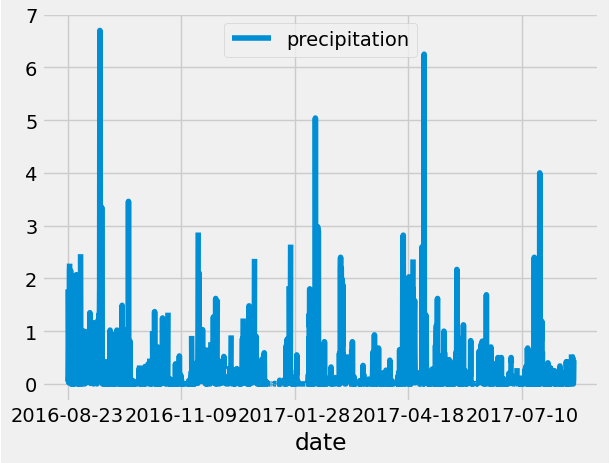
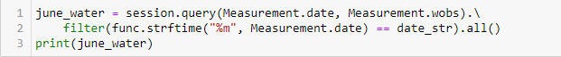
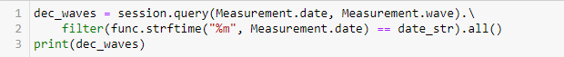

# **Weather Analysis for Waves & Iced Cream Business, LLC Investors**
Using SQLite, SQLAlchemy, Flask, Jupyter Notebook, and Python I analyzed weather patterns (and visualized the data!) and made business recommendations.
## Overview
The purpose of this analysis was to identify weather trends on the island of Oahu in the state of Hawai'i. The database included data from 9 stations and gathered temperature and precipitation. Our dataset spans from 2010 to 2017. In addition to analyzing the dataset, we also prepped an application for investors to access the weather information, and thus support decision-making. 
## Results
- Summary Temperature Statistics for June validate the tropical climate's suitability for both surfing and serving iced cream.
   

- Summary Temperature Statistics for December also validate the tropical climate's suitablility for both a surfing and serving iced cream business.
   

- Because the temperatures are similar in June and December, it is reasonable to draw a conclusion on the weather for July-November. The earlier analysis on precipipation illuminated the suitability of these months due to low historical rainfall.
   

## Summary
The results certainly speak to the potential for profitability due to temperature and precipitation. Perhaps more analysis on the water temperatures and tidal and wave activity for potential locations might also illuminate business intelligence. Gathering data from sensors or stations for water temp, tide info, moon cycle, and wave activity, and then cross-referencing that with other data, such as traffic (pedestrian / vehicular) would further inform business recommendations.
- The code for two additonal queries would look similar to gathering the temperature observations:
  

  

- Generating the summary statistics for this data might help inform investor decisions.  
